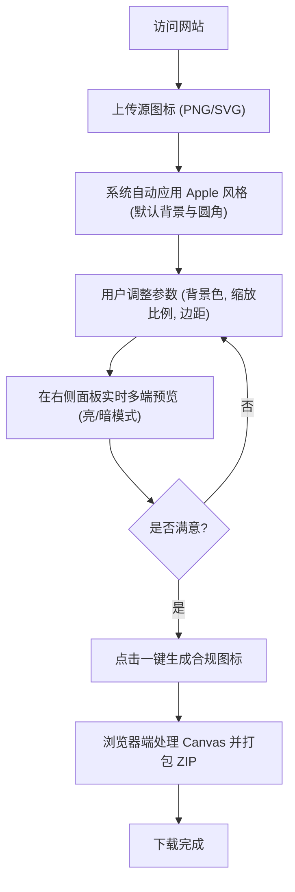

## 1. 产品概述
LogoWear 是一个基于 Nuxt 4 开发的高效网页应用，专为开发者和设计师打造。它的核心功能是帮助用户一键生成带有 Apple 风格（加底色、圆角等）的标准尺寸图标，并提供在不同系统和设备下的全方位预览。
- 解决在不同平台（浏览器、桌面端、移动端）上图标展示不一致的痛点，帮助用户快速验证和导出符合规范的全尺寸图标资产。

## 2. 核心功能

### 2.1 用户角色
| 角色 | 注册方式 | 核心权限 |
|------|---------------------|------------------|
| 普通用户 | 无需注册 | 浏览网页，上传图片，调整参数，预览图标，下载打包好的图标文件 |

### 2.2 功能模块
1. **上传与调整模块**：支持用户上传原图（透明 PNG/SVG 等），调整背景色、图标缩放比例和圆角大小。
2. **多端多色调预览模块**：实时渲染图标在多种场景下的实际展示效果，包括亮色（Light）和暗色（Dark）模式，覆盖浏览器标签页、桌面端（macOS Dock、Windows 任务栏）、系统托盘、以及移动端（iOS 主屏幕、Android 桌面）。
3. **一键生成与导出模块**：一键将当前配置的图标自动裁剪、缩放成符合各平台规范的各种尺寸（如 favicon.ico, apple-touch-icon, android-chrome 等），并打包为 ZIP 文件下载。

### 2.3 页面详情
| 页面名称 | 模块名称 | 功能描述 |
|-----------|-------------|---------------------|
| 工作台主页 | 顶部导航栏 | 品牌 Logo，GitHub 链接，深色/浅色模式切换 |
| 工作台主页 | 左侧控制面板 | 文件上传区，背景颜色拾色器，缩放滑块，圆角调整，导出按钮 |
| 工作台主页 | 右侧预览面板 | 分类展示多端预览（浏览器、macOS、Windows、移动端），支持全局亮/暗色调切换查看 |

## 3. 核心流程
用户进入网站后，无需登录即可开始操作。主要流程为：上传图标 -> 调整背景与间距 -> 多端多主题预览确认 -> 一键导出资产包。

## 4. 用户界面设计

### 4.1 设计风格
- **整体基调**：Apple 风格的极简主义，现代、干净，强调内容与工具属性。
- **主次颜色**：背景使用中性灰白（浅色模式）或深灰黑（深色模式），强调色使用系统蓝或克制的紫色渐变，避免花哨的颜色干扰用户对图标的判断。
- **组件样式**：采用毛玻璃（Glassmorphism）和微妙的阴影来区分层级，按钮与卡片采用圆角设计（如 `rounded-xl` 或 `rounded-2xl`）。
- **字体与排版**：优先使用系统无衬线字体（Inter, SF Pro, Roboto），字号清晰，层级分明。

### 4.2 页面设计概览
| 页面名称 | 模块名称 | UI 元素设计 |
|-----------|-------------|-------------|
| 工作台主页 | 控制面板 | 采用卡片式布局固定在左侧（桌面端），滑块、颜色选择器采用现代且紧凑的控件。 |
| 工作台主页 | 预览面板 | 右侧流式布局，各个预览场景（浏览器、手机等）被封装在带柔和阴影的独立卡片中，模拟真实的系统外壳（如 macOS Dock 栏视觉效果）。 |

### 4.3 响应式策略
- 桌面端优先设计（Desktop-first），左右分栏布局，左侧控制右侧预览，以获得最佳的工具生产力体验。
- 移动端适配（Mobile-adaptive）：在小屏幕下改为上下堆叠布局，控制面板悬浮或置于顶部，预览区在下方滚动。
