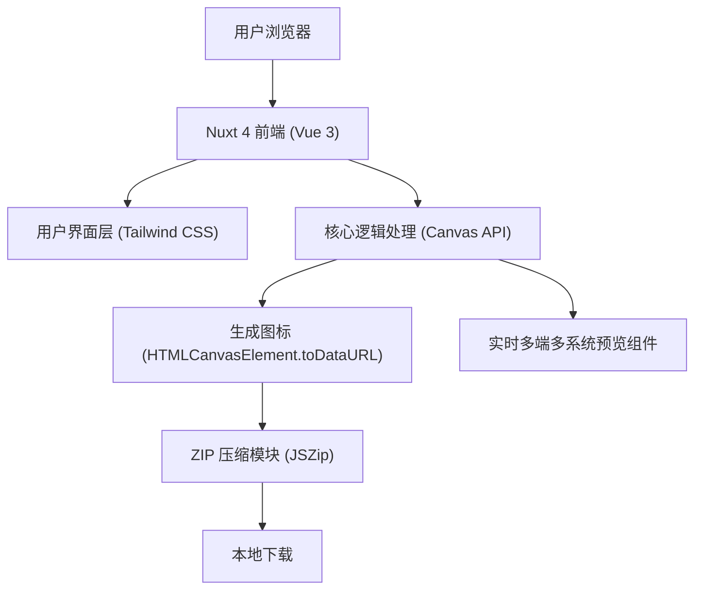

## 1. 架构设计

（注：本项目为纯前端应用，无需后端服务介入）

## 2. 技术栈说明
- **前端框架**: Nuxt 4 (基于 Vue 3 + Vite)
- **UI 及样式**: Tailwind CSS (使用 @nuxtjs/tailwindcss 模块)，搭配可选的无头 UI 组件库 (如 Radix Vue 或 Nuxt UI)。
- **核心图标处理**: 原生 Canvas API 进行图像合成（居中、背景填充、圆角处理）。
- **打包下载**: `jszip` 用于将生成的多个不同尺寸的图片文件打包成 `.zip` 文件，并配合 `file-saver` 触发本地下载。
- **状态管理**: Nuxt 自带的 `useState` 或 Pinia 进行参数状态（图标 URL，背景色，缩放比例等）跨组件共享。

## 3. 路由定义
| 路由路径 | 功能说明 |
|-------|---------|
| `/` | 首页及工作台主界面 |

## 4. 核心逻辑与文件输出规范
项目旨在生成符合标准尺寸及 Apple 风格加底色的图标资产，前端通过 Canvas 批量处理以下规格（供参考）：
- `favicon.ico` (32x32)
- `apple-touch-icon.png` (180x180)
- `android-chrome-192x192.png`
- `android-chrome-512x512.png`
- `icon-maskable-512x512.png` (适用于 PWA 遮罩)
- 桌面端高分屏通用图标 (256x256, 1024x1024) 等。

前端实时预览将针对以上不同平台，结合 Tailwind 的 `dark:` 修饰符展示不同系统（iOS/macOS/Windows 等）的界面外壳（Mockup）和图标适配效果。

## 5. API 定义 (若有后端)
纯前端，无后端 API。

## 6. 服务器架构图 (若有后端)
纯前端，部署在静态托管服务（Vercel, Netlify 或 GitHub Pages 等）。

## 7. 数据模型 (若适用)
无数据库存储。用户所有操作基于本地浏览器会话状态（Local State）。
